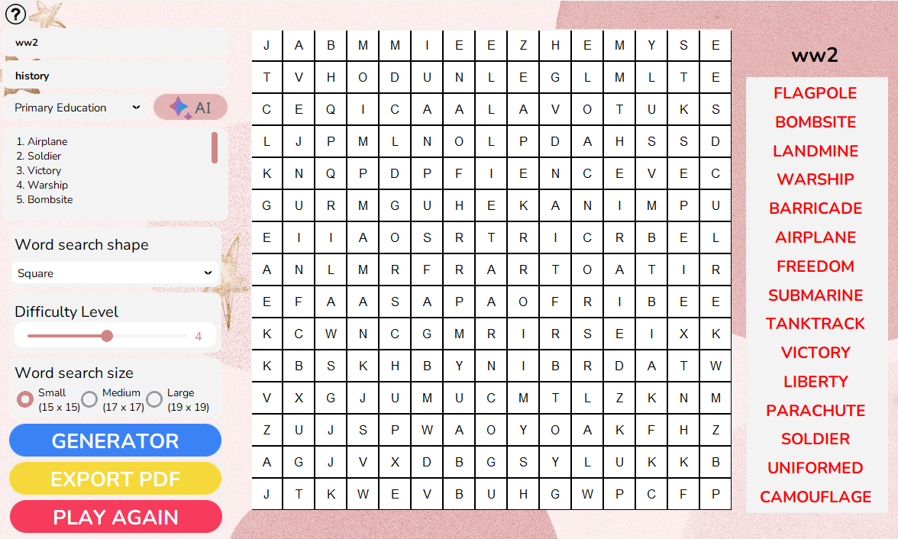

# Word Search Generator


[Video Demo](https://youtu.be/YfVdxHjWbA4)

[Report](https://drive.google.com/file/d/1bsxYMzypz-orI2hHIuJU5c9oftmAPY4V/view?usp=sharing)
## Introduction
### Overview
The Word Search Generator is a tool used to create random word search games. It's an excellent tool for improving vocabulary and observation skills, while also providing an enjoyable form of entertainment. The Word Search Generator is particularly suitable for teachers who want to create engaging learning activities for students, or for anyone who wants to create a personalized word search game.
### Feature
1. Generate a random alphabet grid.
2. Support multiple grid shapes.
3. Customize grid size and difficulty level.
4. Interact directly with the grid.
5. Provide hints for solving the word search.
6. Export the word search as a PDF.
7. AI assistance in generating themed, subject-specific, and grade-level words.



## Installation
### Set up required dependencies
1. Open a terminal or command prompt.
2. Navigate to the root directory of your project.
3. Run the following command:

```python 
pip install -r requirements.txt
```

### Create `.env` file
Here we utilize OpenAI's chatbot to generate words. To use this feature, follow these steps:
1. Create a New File: Create a new file in your project directory and name it `.env`. You can use any text editor to create this file.
2. Add Your API Key: In the `.env` file, add the following line:
```makefile
OPENAI_API_KEY=your-api-key-goes-here
```
Replace your-api-key-goes-here with your actual OpenAI API key. If you haven't obtained an API key yet, follow [these instructions](https://platform.openai.com/docs/quickstart/account-setup) to generate one.

3. Save the File: Save the `.env` file in your project directory.

## Instruction manual
1. Open a terminal or command prompt.
2. Navigate to the root directory of your project.
3. Run the following commands:

```python 
cd src
python MainMenu.py
```

## Personas, User story and Scenarios

### Personas
**Name:** Emily Thompson  
**Age:** 28  
**Occupation:** Software Developer  
**Background:** Born and raised in New York City, Emily comes from a family of educators and has always been fascinated by technology. She pursued her passion and graduated from MIT with a degree in Computer Science.  
**Skills:** Proficient in various programming languages, problem-solving, attention to detail, and strong analytical skills.  
**Perspective:** Emily believes in the power of continuous learning and the importance of using technology to solve real-world problems.  
**Hobbies:** Enjoys hiking, playing the piano, and attending tech meetups to stay updated with the latest trends in the industry.  
**Goal for Word Search Game:** Emily plans to use the game to unwind and keep her mind sharp while also challenging her lexical and pattern recognition skills.

### User story
**Title:** Engaging Word Search for Relaxation  

**As a** software developer with a passion for continuous learning and mental challenges,  
**I want** to have a fun and engaging Word Search game on my mobile device,  
**So that** I can unwind after a long day at work while keeping my mind sharp and expanding my vocabulary.  

**Acceptance Criteria:**  
1. The game should offer various themed word lists to cater to my diverse interests.
2. It should have adjustable difficulty levels to provide a challenge without being too overwhelming.
3. The interface should be user-friendly and visually appealing for a pleasant gaming experience.
4. The game should save my progress allowing me to continue from where I left off in the previous session.
5. It should provide positive reinforcement through achievements or rewards for completing challenges.
6. The game should be accessible on both iOS and Android to fit my device preferences.

By fulfilling these criteria, I aim to have an enjoyable and mentally stimulating activity that not only helps me relax but also contributes to my personal and cognitive development.

### Scenarios
**Scenario 1: Theme Variety**  
*Background:* After a challenging day at work, Emily is looking to relax and wind down.  
*Goal:* Emily launches the Word Search game on her smartphone. She wants an array of options to suit her diverse interests.  
*Action:* She selects the "Nature" theme from the game's list and begins searching for words related to the environment and wildlife.  
*Result:* Emily enjoys a soothing and engaging experience, feeling reconnected with nature while unwinding from her busy day.

**Scenario 2: Challenging Fun**  
*Background:* It's the weekend, and Emily is in the mood for a mental challenge.  
*Goal:* Emily opens the Word Search game on her tablet, eager for a stimulating experience.  
*Action:* She sets the game to the highest difficulty level and chooses the "Science and Technology" theme.  
*Result:* As she discovers complex technical terms, Emily feels mentally invigorated and satisfied with the brain-teasing adventure.


## Group members
1. Quản Xuân Sơn
2. Nguyễn Trường Huy
3. Trần Văn Dy

